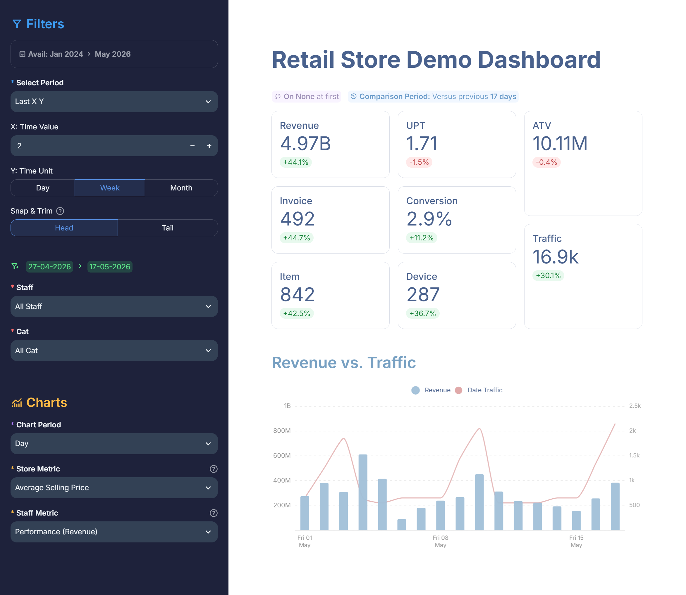
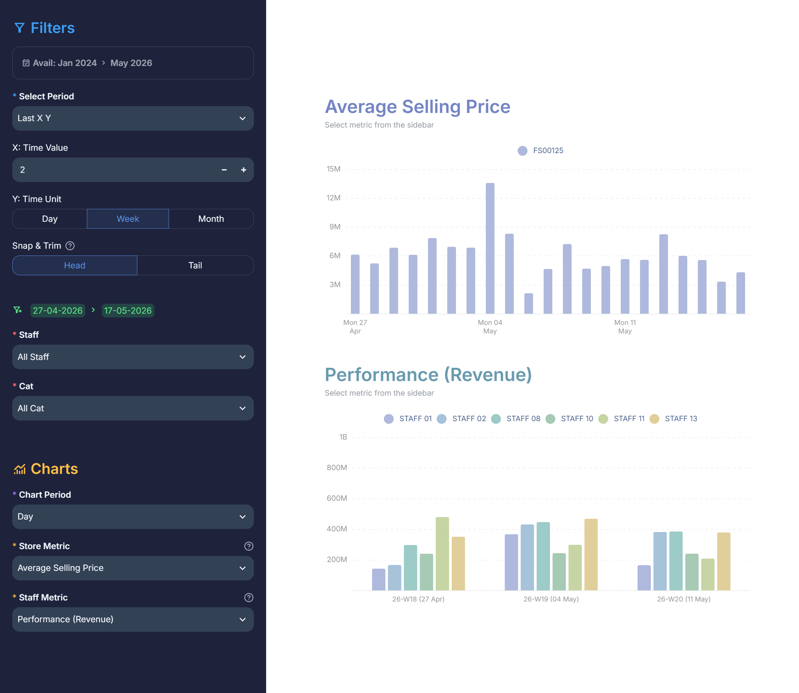
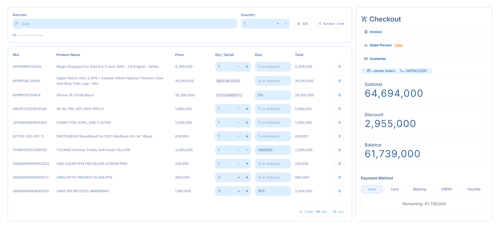
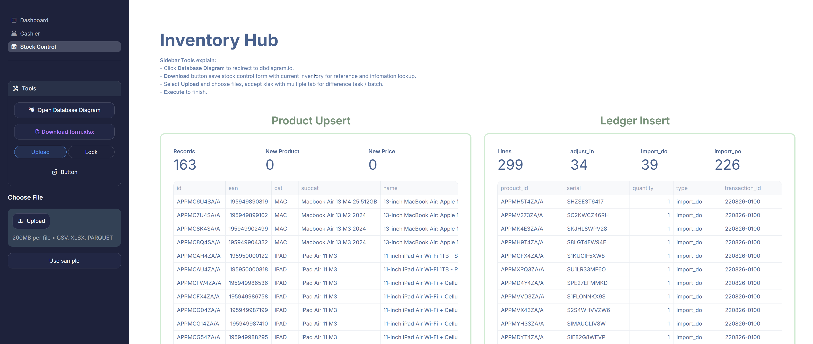

# james-webb

A retail analytics dashboard. Built on top of a POS + inventory system I wrote as an excuse to actually learn SQL.

## What it does

- **Dashboard**: period-over-period comparisons (any custom range, not just "vs last month"), configurable KPI pivots by store or staff, dual-axis trend charts.

<table>
<tr>
<td></td>
<td></td>
</tr>
</table>

- **POS**: barcode scanning, serial-number tracking, multi-method payment, invoice lookup and cancellation.

- **Database**: every stock movement (sales, returns, transfers, adjustments) goes through one ledger table. Stock never goes negative. Concurrent checkouts never oversell the same item, enforced by Postgres advisory locks, not application code.

Bulk product upsert and ledger insert via XLSX upload — multi-tab batch support for different transaction types (import_do, import_po, adjust_in). Links out to the database diagram for reference.

## Stack
Streamlit · Neon (PostgreSQL) · Polars · Apache ECharts

## The interesting bits

**A month-long access violation bug, solved by pattern, not by docs.**
Streamlit + Polars crashed with a Windows access violation under concurrent reruns. No stack trace pointed anywhere useful. Fix attempts and how many clicks they survived before crashing:
- Polars max_threads=1: 110 clicks
- `gc.collect()` at the top of the function: 177 clicks, then 665 on a second run (gave up trying to trust it)
- No max_threads limit: 283 clicks

The actual pattern only showed up after logging click sequences: Last X Y → Staff_01 → Day, every time. Turned out Streamlit's ScriptRunner was just too messy under the hood for what I was doing. That's what pushed me to learn threading properly and write a custom thread pool. Solved.

**The pool exists to keep the dashboard non-blocking.**
Sidebar filtering, KPI cards, and charts each run their own Polars aggregation through `@supreme`, wrapped in `st.fragment(parallel=True)`. A filter change, a metric recompute, and a chart re-render can all execute concurrently instead of queuing behind each other on Streamlit's single thread.

**Stock math lives in SQL, not Python.**
`check_out()` and `insert_ledger()` do the item insert, the stock check, and the ledger write in one atomic query, with an advisory lock so two simultaneous checkouts can't both "win" the last unit in stock. If anything doesn't add up, the whole transaction rolls back.

**Serial numbers are just... numbers, until they're not.**
Serialized items (electronics, devices) and regular quantity-based items share the same ledger, same table, same logic. The SQL enforces "max stock of 1 per serial" and "a product can't mix serial and non-serial history" as constraints, not app-level checks.

**Charts are config, not copy-paste.**
One `transformer()` function turns a dataframe plus a dict of column/aggregation/unit settings into a fully-styled dual-axis ECharts chart: bar, line, or both, any metric, any groupby. Tooltip formatting, y-axis scaling, and number formatting (k/M/B, %, currency) are all JS injected from Python, driven by the same config. Add a new chart by changing a dict, not by writing more chart code.

**Caching now lives in process memory, not `st.cache_data`.**
`brief_cache` is a sys-level singleton shared by every session — fetched once, read by all. `first_fetch()` pulls all `fetch_jobs` through the worker pool in parallel at startup. `.clear(*keys)` re-fetches given keys (or all, if none passed) as a batch, then commits atomically under one lock — no reader ever sees a half-updated cache.

## Why
I wanted a good dashboard. Building a POS gave me an excuse to learn advanced SQL and write real CRU (no delete, it's a ledger) against real self-inflicted problems: race conditions, oversold stock, concurrent writes. Not toy exercises.
